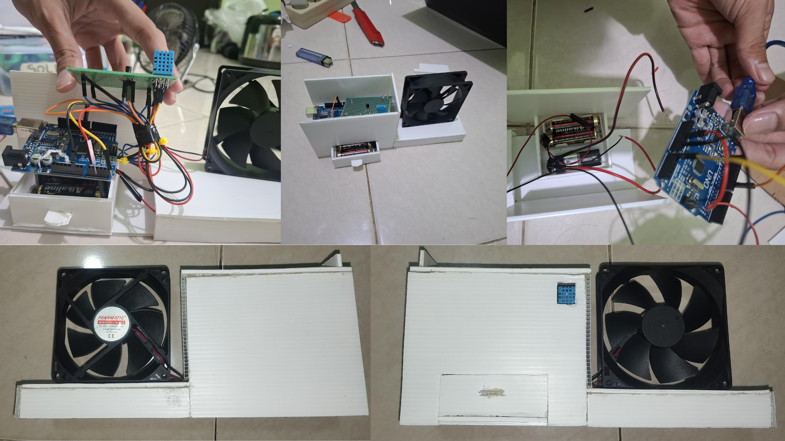
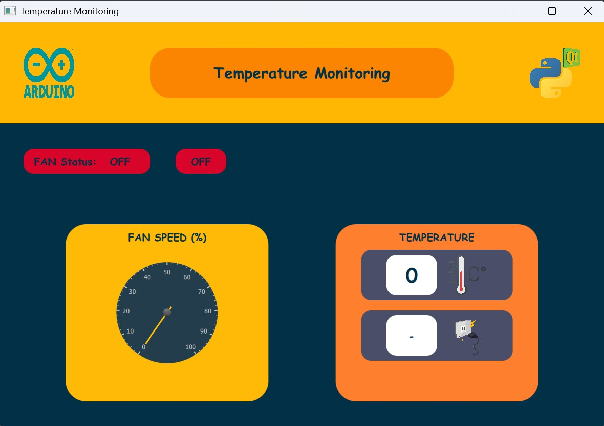
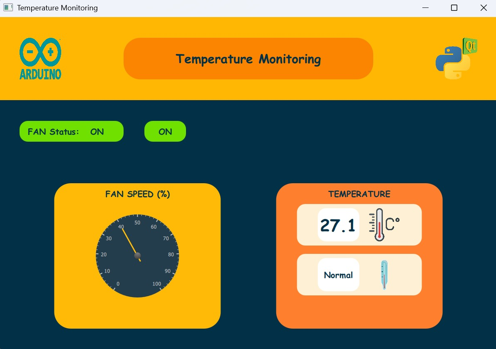

# Sistem Kendali On/Off dan Kecepatan Kipas Otomatis Berbasis Suhu 🌡️💨


Proyek ini bertujuan untuk mengembangkan prototipe kipas otomatis yang mampu mengatur kecepatan dan status *on/off* berdasarkan suhu ruangan secara *real-time*. Sistem ini mengintegrasikan teknologi mikrokontroler, sensor suhu, dan antarmuka pengguna grafis (GUI) untuk menciptakan perangkat yang efisien, responsif, dan ramah pengguna.
> Waktu Pengerjaan: November - Desember 2024

---

## Hardware Kipas Otomatis Berbasis Suhu



## Antarmuka Pengguna (UI Layout)

Berikut adalah tampilan antarmuka sistem saat kondisi perangkat keras mati (OFF) dan saat aktif (ON):

<p align="center">
  
  
  
</p>

---

## 👥 Tim Pengembang

Proyek ini dikembangkan oleh:

| No | Nama Anggota |
|:--:|:---|
| 1 | Andhika Pratama |
| 2 | Faqihuddin Al Ghiffary |
| 3 | Fauzi Ramdani |
| 4 | Pramudya Aditama Sudrajat |
| 5 | Ripan |

---

## ✨ Fitur Utama

1. **Pengaturan Kecepatan Otomatis** 🌀

   Kipas akan menyesuaikan kecepatan secara dinamis dalam 4 tingkat berdasarkan pembacaan suhu saat ini:
   - **Mati:** Suhu < 25°C
   - **Kecepatan Rendah:** 25°C – 30°C
   - **Kecepatan Sedang:** 30°C – 35°C
   - **Kecepatan Tinggi:** > 35°C

3. **Sistem Kendali On/Off Otomatis** ⚡

   Kipas akan menyala atau mati sepenuhnya sesuai dengan ambang batas suhu ruangan tanpa intervensi manual.

5. **Antarmuka Pengguna (GUI)** 💻

   Dilengkapi dengan aplikasi desktop berbasis QML (Frontend) dan Python (Backend) untuk memantau suhu secara langsung dan memberikan opsi kontrol *on/off* kipas secara manual.

7. **Efisiensi Energi** 🔋

   Sistem hanya mengoperasikan kipas pada kecepatan yang dibutuhkan, sehingga secara signifikan mengurangi konsumsi daya yang terbuang.

---

## 🛠️ Komponen Sistem

### Hardware
*   **Mikrokontroler:** Arduino Uno R3
*   **Sensor Suhu:** DHT11
*   **Transistor / Driver:** MOSFET 2N7000
*   **Aktuator:** Kipas DC Panamatic 9225
*   **Sumber Daya:** Baterai 12V

### Software
*   **Arduino IDE:** Pemrograman logika mikrokontroler.
*   **Thonny (Python):** Pengembangan *backend* dan integrasi serial komunikasi.
*   **Visual Studio Code (QML):** Desain dan pembuatan antarmuka *frontend* GUI.

---

## 🔄 Diagram Alir (Flowchart) Cara Kerja

Berikut adalah alur logika sistem dalam mengatur kipas berdasarkan suhu ruangan:

```mermaid
graph TD
    A([Mulai]) --> B[/Baca Suhu dari DHT11/]
    B --> C{Suhu < 25°C?}
    
    C -- Ya --> D[Kipas MATI]
    C -- Tidak --> E{Suhu 25°C - 30°C?}
    
    E -- Ya --> F[Kipas Kecepatan RENDAH]
    E -- Tidak --> G{Suhu 30°C - 35°C?}
    
    G -- Ya --> H[Kipas Kecepatan SEDANG]
    G -- Tidak --> I[Kipas Kecepatan TINGGI]
    
    D --> J[/Update Data ke GUI/]
    F --> J
    H --> J
    I --> J
    
    J --> B
